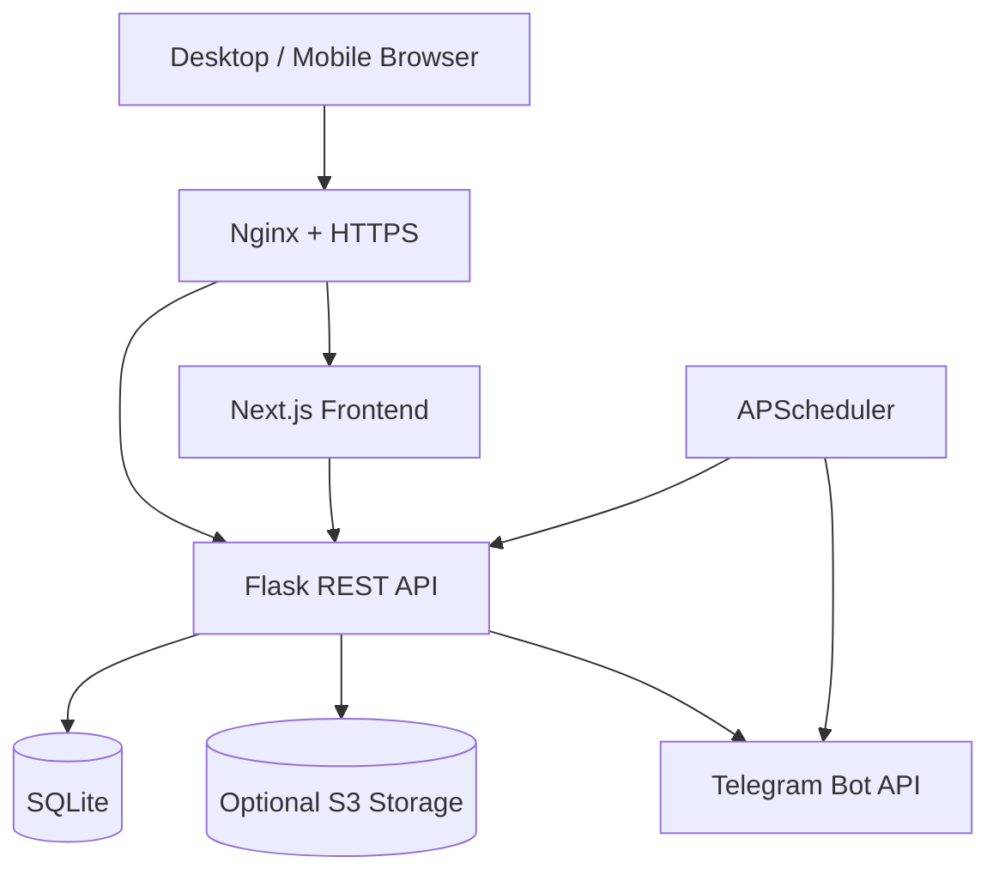

# Industrial Maintenance CMMS

A full-stack Computerized Maintenance Management System (CMMS) for QR-driven equipment maintenance, breakdown reporting, preventive-maintenance scheduling, inventory forecasting, technician workflows, and automated management reporting.

> Portfolio-safe public version: production credentials, operational reports, generated QR assets, databases, and uploaded maintenance files are intentionally excluded from source control.

## Highlights

- QR-based machine lookup and maintenance workflows
- Breakdown reporting with photo/document uploads
- Preventive-maintenance work orders and scheduling
- Machine risk scoring based on maintenance history
- Spare-parts burn-rate forecasting and low-stock alerts
- Weekly PDF executive reports
- Telegram alert integration using environment-based credentials
- Hindi/English voice-assisted service notes in the web UI
- Optional S3-backed file storage with local fallback
- Responsive Next.js dashboard backed by a Flask API

## Architecture



## Tech Stack

| Layer | Technology |
| --- | --- |
| Frontend | Next.js, React, TypeScript, Tailwind CSS, Recharts |
| Backend | Python, Flask, Flask-SQLAlchemy |
| Database | SQLite |
| Scheduling | APScheduler |
| Reporting | fpdf2, openpyxl |
| File handling | Pillow, optional AWS S3/boto3 |
| Notifications | Telegram Bot API |
| Deployment | Nginx, PM2, HTTPS |

## Predictive Logic

The current predictive engine flags a machine as critical when it records **3 or more breakdowns within a 5-day window**. This is a rule-based risk signal rather than an ML failure-probability model.

Inventory forecasting uses the previous 30 days of recorded part consumption to estimate a daily burn rate. Parts projected to run out within 7 days can trigger an alert.

## Local Setup

### Backend

```bash
git clone https://github.com/Thatweirdguy1/premindustries1.git
cd premindustries1
python -m venv .venv
```

Activate the virtual environment, then:

```bash
pip install -r requirements.txt
cp .env.example .env
python init_db.py
python app.py
```

The API runs on `http://127.0.0.1:5000` by default.

### Frontend

```bash
cd frontend
npm ci
npm run dev
```

The frontend runs on `http://localhost:3000` by default.

## Configuration

Copy `.env.example` to `.env` and configure only the integrations you need.

```env
CMMS_ALLOWED_ORIGINS=http://localhost:3000
TELEGRAM_BOT_TOKEN=
TELEGRAM_CHAT_ID=
AWS_ACCESS_KEY_ID=
AWS_SECRET_ACCESS_KEY=
AWS_BUCKET_NAME=
AWS_REGION=ap-south-1
```

Secrets must never be committed. Telegram and AWS integrations remain disabled when their required environment variables are absent.

## Repository Hygiene

The repository deliberately ignores:

- `.env` and private keys
- SQLite databases
- uploaded maintenance files
- generated PDFs and spreadsheets
- generated QR-code directories
- build output and dependencies
- logs and temporary files

Operational or personally identifiable factory data should remain outside the public repository.

## API Health Check

```bash
curl http://127.0.0.1:5000/api/health
```

Expected response:

```json
{"status":"ok"}
```

## Deployment Notes

A typical deployment places Nginx in front of the Next.js frontend and Flask backend and terminates HTTPS at Nginx. Production configuration should use explicit CORS origins, environment-injected secrets, restricted host/firewall rules, and a production process manager.

The repository intentionally does not contain production IP addresses, credentials, internal reports, user-uploaded maintenance data, or deployment secrets.

## Security

If a credential has ever been committed to Git history, removing it in a later commit is **not sufficient**. Revoke/rotate the credential first, then purge the historical blob separately if required.

For deployment, also consider authentication/authorization, CSRF protection where applicable, API rate limiting, upload-size limits, malware/content scanning for uploaded documents, database backups, and centralized logging.

## Project Context

This project demonstrates practical full-stack engineering around an industrial maintenance workflow: application architecture, mobile usability, QR-driven navigation, persistence, background jobs, reporting, notifications, deployment configuration, and iterative production debugging.

### ⚖️ Licensing & Commercial Disclaimer

This software is published under the **PolyForm Noncommercial License 1.0.0**. 

### 🚫 Commercial Use Restriction

* **Permitted:** Personal use, educational projects, research, evaluation, and testing.
* **Prohibited:** Any commercial, production, or corporate operational use by third parties. You may **not** use this software to manage external commercial facilities, run business maintenance operations, or generate revenue without explicit permission.

### 💼 Commercial Licensing Requests

If your organization or business wishes to use this CMMS software for commercial operations, production environments, or internal facility management, you must obtain a separate commercial license. 

For inquiries, commercial licensing agreements, or custom deployment requests, please contact: 

* **Company:** [Prem Industries India Limited](https://prempackaging.com/)
* **Platform:** [Prem Industries Dadri CMMS](https://prem-dadri-cmms.duckdns.org)
