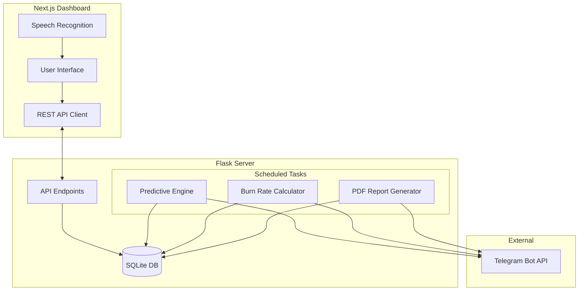

# 🏭 Dadri Plant Control (CMMS)

  

A next-generation, AI-assisted Computerized Maintenance Management System (CMMS) built specifically for the **Prem Industries - Dadri Plant**. This software tracks breakdowns, schedules preventive maintenance, predicts spare parts depletion, and generates automated executive reports.

---

## ✨ Core Features

### 🧠 1. Predictive Maintenance Engine
Monitors machine health in real-time. If a machine breaks down **3 or more times within a 10-day rolling window**, the engine automatically flags the machine as `CRITICAL` and dispatches an emergency Telegram alert to the engineering team.

### 📦 2. Smart Inventory & Burn Rate API
Tracks the consumption of spare parts on the factory floor. The engine calculates the **Daily Burn Rate** based on the last 30 days of usage. If any spare part is predicted to hit zero inventory in **7 days or less**, it automatically triggers a reorder alert via Telegram.

### 📊 3. Automated Executive Reporting
Every Monday at 8:00 AM, a background cron job compiles the plant's health metrics:
*   **Total Plant Downtime** (Hours)
*   **Mean Time To Repair (MTTR)**
*   **Top 5 Problematic Machines**
It generates a clean, high-contrast PDF report and uploads it directly to the management Telegram group. The reports are also downloadable from the main dashboard.

### 🗣️ 4. Voice-to-Text Integration
Technicians on the floor can use the built-in speech recognition to dictate their service notes and resolution reports hands-free (Supports Hindi & English).

---

## 🏗️ System Architecture



---

## 📈 Inventory Prediction Logic


---

## 🛠️ Technology Stack

| Component | Technology | Description |
| :--- | :--- | :--- |
| **Frontend** | `Next.js`, `React`, `Tailwind CSS` | High-performance, SSR-capable React framework styled with a raw, high-contrast "Newsprint" aesthetic. |
| **Backend** | `Python 3.12`, `Flask` | Lightweight, robust API server handling data routing and business logic. |
| **Database** | `SQLite3` | Self-contained, serverless SQL database perfect for low-latency read/writes. |
| **Task Scheduler**| `APScheduler` | In-memory cron-job runner executing Python functions on exact intervals. |
| **PDF Generation**| `fpdf2` | Pure Python library used to draw and compile the weekly executive summaries. |
| **Deployment** | `DigitalOcean`, `Nginx`, `PM2` | Hosted on a dedicated Ubuntu Droplet, managed by PM2 process manager and reverse-proxied via Nginx. |

---

## 🚀 Deployment & Installation

If deploying to a fresh DigitalOcean Ubuntu droplet, follow these steps:

### 1. Clone & Setup
```bash
git clone https://github.com/Thatweirdguy1/premindustries1.git ~/dadri-cmms
cd ~/dadri-cmms
```

### 2. Python Backend
```bash
# It is highly recommended to use a virtual environment
python3 -m venv venv
source venv/bin/activate

# Install dependencies
pip install -r requirements.txt
pip install fpdf2

# Start with PM2
pm2 start app.py --name dadri-backend --interpreter ./venv/bin/python
```

### 3. Next.js Frontend
```bash
cd frontend
npm install
npm run build

# Start with PM2
pm2 start npm --name "dadri-frontend" -- start
```

---

## 📝 Maintenance & Updates

This README serves as the source of truth for the project's architecture and capabilities. **It must be updated immediately upon the completion of any new feature or architectural change.** 

> *Property of Prem Industries - Dadri Plant. Unauthorized distribution is prohibited.*
