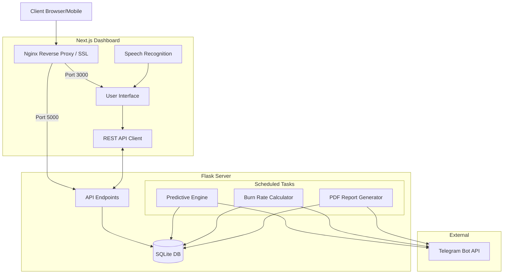
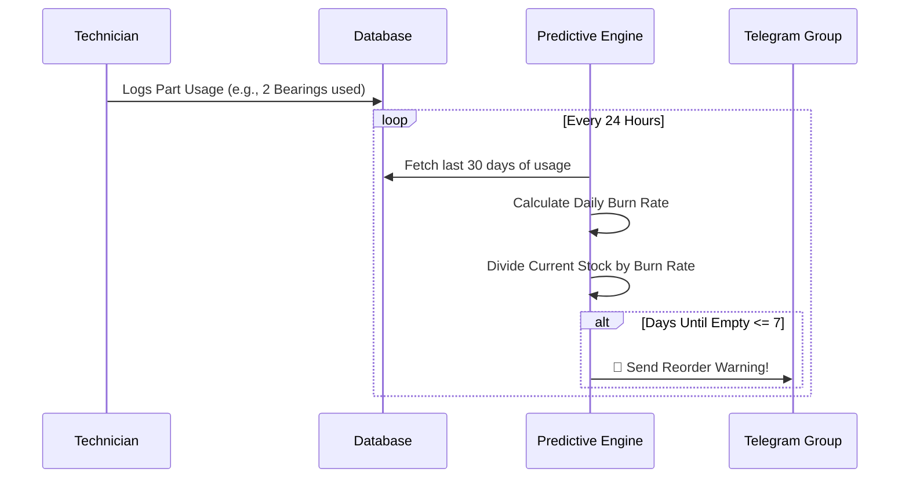

# 🏭 Dadri Plant Control (CMMS)

  

A next-generation, AI-assisted Computerized Maintenance Management System (CMMS) built specifically for the **Prem Industries - Dadri Plant**. This software tracks breakdowns, schedules preventive maintenance, predicts spare parts depletion, and generates automated executive reports.

---

## ✨ Core Features

### 🧠 1. Predictive Maintenance Engine
Monitors machine health in real-time. If a machine breaks down **3 or more times within a 5-day rolling window**, the engine automatically flags the machine as `CRITICAL` and dispatches an emergency Telegram alert to the engineering team.

### 📦 2. Smart Inventory & Burn Rate API
Tracks the consumption of spare parts on the factory floor. The engine calculates the **Daily Burn Rate** based on the last 30 days of usage. If any spare part is predicted to hit zero inventory in **7 days or less**, it automatically triggers a reorder alert via Telegram.

### 📊 3. Automated Executive Reporting
Every Monday at 8:00 AM, a background cron job compiles the plant's health metrics:
*   **Total Plant Downtime** (Hours)
*   **Mean Time To Repair (MTTR)**
*   **Top 5 Problematic Machines**
It generates a clean, high-contrast PDF report and uploads it directly to the management Telegram group. The reports are also downloadable from the main dashboard.

### 🗣️ 4. Voice-to-Text Integration
Technicians on the floor can use the built-in speech recognition to dictate their service notes and resolution reports hands-free (Supports Hindi & English).

---

## 🏗️ System Architecture



---

## 📈 Inventory Prediction Logic



---

## 🛠️ Technology Stack

| Component | Technology | Description |
| :--- | :--- | :--- |
| **Frontend** | `Next.js`, `React`, `Tailwind CSS` | High-performance, SSR-capable React framework styled with a raw, high-contrast "Newsprint" aesthetic. |
| **Backend** | `Python 3.12`, `Flask` | Lightweight, robust API server handling data routing and business logic. |
| **Database** | `SQLite3` | Self-contained, serverless SQL database perfect for low-latency read/writes. |
| **Task Scheduler**| `APScheduler` | In-memory cron-job runner executing Python functions on exact intervals. |
| **PDF Generation**| `fpdf2` | Pure Python library used to draw and compile the weekly executive summaries. |
| **Deployment** | `DigitalOcean`, `Nginx`, `PM2` | Hosted on a dedicated Ubuntu Droplet, managed by PM2 process manager and reverse-proxied via Nginx. |

---

## 🚀 Deployment & Installation (Production)

To deploy to a DigitalOcean Ubuntu droplet with full SSL (required for Voice-to-Text):

### 1. Clone & Setup
```bash
git clone https://github.com/Thatweirdguy1/premindustries1.git ~/dadri-cmms
cd ~/dadri-cmms
```

### 2. Python Backend
```bash
python3 -m venv venv
source venv/bin/activate
pip install -r requirements.txt
pm2 start app.py --name dadri-backend --interpreter ./venv/bin/python
```

### 3. Configuration (secrets)
All credentials are read from the environment — nothing is hardcoded. Copy the
template and fill it in; `.env` is gitignored and must never be committed.

```bash
cp .env.example .env
nano .env                      # TELEGRAM_BOT_TOKEN, TELEGRAM_CHAT_ID, QR_BASE_URL
set -a && . ./.env && set +a   # export before starting the backend
```

| Variable | Required | Effect if unset |
| :--- | :--- | :--- |
| `TELEGRAM_BOT_TOKEN` | Yes | All Telegram alerts are skipped and logged to stdout instead. |
| `TELEGRAM_CHAT_ID` | Yes | Same as above. Numeric group id, keep the leading `-`. |
| `QR_BASE_URL` | For QR printing | `generate_qrs.py` falls back to `localhost` and prints unusable stickers. |
| `AWS_ACCESS_KEY_ID` / `AWS_SECRET_ACCESS_KEY` | No | Photos are stored locally under `static/uploads/` instead of S3. |

### 4. Next.js Frontend
```bash
cd frontend
npm install
npm run build
pm2 start npm --name "dadri-frontend" -- start
```

### 5. Nginx & SSL (HTTPS)
> **Note:** A domain name (e.g., DuckDNS) is required to generate an SSL certificate. The Voice-to-Text Web Speech API will **not** work on mobile devices without HTTPS.

```bash
sudo apt install -y nginx certbot python3-certbot-nginx

# Create Nginx config to route / to port 3000, and /api/ to port 5000
cat << 'EOF' > /etc/nginx/sites-available/dadri-cmms
server {
    listen 80;
    server_name YOUR_DOMAIN.duckdns.org;

    location /api/ { proxy_pass http://127.0.0.1:5000/api/; }
    location /static/ { proxy_pass http://127.0.0.1:5000/static/; }
    location / { proxy_pass http://127.0.0.1:3000; }
}
EOF

sudo ln -s /etc/nginx/sites-available/dadri-cmms /etc/nginx/sites-enabled/
sudo systemctl restart nginx
sudo certbot --nginx -d YOUR_DOMAIN.duckdns.org --redirect
```

### 6. Machine QR Stickers
Each machine gets a sticker that opens its mobile report page directly. Generate
these **after** SSL is live, so the codes carry the HTTPS domain — the Web Speech
API dictation will not run from a plain `http://` origin.

```bash
QR_BASE_URL=https://YOUR_DOMAIN.duckdns.org python generate_qrs.py
```

Writes two sets, one file per machine, named `ID<id>_<asset_tag>.png`:

*   `qr_codes/` — bare QR codes at full resolution.
*   `labeled_qrs/` — print-ready stickers with the machine name and `ID | Tag` caption.

Codes encode `<QR_BASE_URL>/m?id=<machine_id>`, where the id comes from the
`machines` table. **Re-run this whenever machines are re-seeded** — the ids shift
and previously printed stickers will then open the wrong machine.

---

## 📝 Maintenance & Updates

This README serves as the source of truth for the project's architecture and capabilities. **It must be updated immediately upon the completion of any new feature or architectural change.** 

> *Property of Prem Industries - Dadri Plant. Unauthorized distribution is prohibited.*
